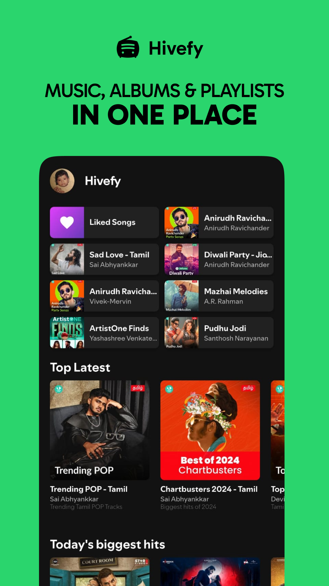

<div align="center">


# 🎧 AppMusicaSpf Hivefy

### Plataforma musical moderna inspirada en Spotify 🚀

<p align="center">
  Hivefy es una aplicación musical <b>FOSS</b>, moderna y libre de anuncios desarrollada con <b>Flutter</b>, diseñada para streaming online y reproducción offline con una experiencia premium inspirada en Spotify.
</p>

<p align="center">
  
  
  
  
  
  
</p>

<p align="center">
  <a href="#-preview">Preview</a> •
  <a href="#-características">Características</a> •
  <a href="#-tecnologías-utilizadas">Tecnologías</a> •
  <a href="#-instalación">Instalación</a> •
  <a href="#-roadmap">Roadmap</a>
</p>

</div>

---

# 🌊 Acerca de Hivefy

**Hivefy** es una aplicación de streaming musical multiplataforma enfocada en ofrecer una experiencia rápida, elegante y completamente libre de anuncios.

Inspirada visualmente en Spotify, la aplicación combina una interfaz moderna con funcionalidades avanzadas como reproducción offline, descargas locales, caché inteligente y sincronización multimedia.

El proyecto fue desarrollado utilizando **Flutter** y múltiples tecnologías modernas para ofrecer rendimiento optimizado, animaciones fluidas y una arquitectura escalable.

---

# 📸 Preview

<div align="center">


</div>

---

# 📱 Capturas de Pantalla

<div align="center">




</div>

---

# ✨ Características

# 🎨 Experiencia Moderna

- 🎵 UI inspirada en Spotify
- ✨ Animaciones fluidas
- 🎨 Material You Dynamic Theme
- 📱 Diseño responsive
- 🌙 Dark Mode
- 🔥 Tipografía personalizada SpotifyMix

---

# 🎧 Reproductor Multimedia

- ▶️ Reproducción en segundo plano
- ⏯️ Play / Pause
- ⏭️ Next / Previous
- 📍 Seek visual interactivo
- 🎚️ Controles multimedia avanzados
- 🔔 Notificaciones multimedia
- 🎶 Miniplayer animado

---

# 💾 Offline First

- ☁️ Descarga de canciones
- 📂 Almacenamiento local
- 🎵 Descarga de playlists y álbumes
- 🧹 Limpieza automática de archivos inválidos
- ⚡ Caché inteligente

---

# 🔍 Biblioteca Inteligente

- 🌐 Búsqueda global
- 🎤 Artistas
- 💿 Álbumes
- 📜 Playlists
- 🎶 Canciones
- 💾 Biblioteca persistente con Hive DB

---

# ⚙️ Configuración Avanzada

- 🌍 Selector de servidores
- 💾 Gestión de caché
- 🎨 Cambio de tema
- 📡 Monitor de descargas
- 🔧 Configuración avanzada de reproducción

---

# 🌐 Hivefy Web

## 🚀 Disponible también en navegador

Hivefy cuenta con una versión web rápida y responsiva desarrollada con tecnologías modernas.

### ✨ Características Web

- 🎨 UI inspirada en Spotify
- ⚡ Experiencia ligera
- 🔍 Búsqueda global
- 💾 Caché offline
- 🎧 Media Session API
- 🌍 Multi-language support

---

# 🎥 Demo

<div align="center">

https://user-images.githubusercontent.com/demo/hivefy-demo.mp4

</div>

---

# 🛠️ Tecnologías Utilizadas

## 📱 Desarrollo Mobile

<p>
  
</p>

- Flutter
- Dart
- Android Studio
- VS Code

---

## 🎵 Audio & Streaming

- just_audio
- audio_service
- just_audio_background
- Media Session API

---

## 💾 Almacenamiento

- Hive DB
- Shared Preferences
- Path Provider
- Local Cache System

---

## 🌐 Networking

- Dio
- HTTP
- HTML Unescape

---

## 🎨 UI & UX

- Material You
- Shimmer Effects
- Cached Network Image
- Animated Mini Player
- Responsive Layouts

---

## ⚙️ Arquitectura

- Flutter Riverpod
- State Management
- Modular Services
- Clean Architecture

---

## 🧰 Herramientas

<p>
  
</p>

- Git & GitHub
- Firebase
- Next.js
- SourceForge

---

# 📂 Estructura del Proyecto

```bash
Hivefy/
│
├── assets/             # Recursos gráficos y multimedia
├── lib/
│   ├── services/       # APIs y lógica backend
│   ├── views/          # Pantallas y UI
│   ├── models/         # Modelos de datos
│   ├── providers/      # State management
│   ├── widgets/        # Componentes reutilizables
│   └── utils/          # Utilidades
│
├── android/            # Configuración Android
├── ios/                # Configuración iOS
├── web/                # Soporte Web
└── README.md
```

---

# ⚡ Instalación

## 1️⃣ Clonar el repositorio

```bash
git clone https://github.com/isairey/AppMusicaSpf.git
cd AppMusicaSpf
```

---

# 🔥 Requisitos

- Flutter SDK 3.7+
- Android Studio o VS Code
- JDK 17+
- Android 7.0+
- Dispositivo físico o emulador

---

# ▶️ Ejecutar Proyecto

## Instalar dependencias

```bash
flutter pub get
```

---

## Ejecutar aplicación

```bash
flutter run
```

---

# 🚀 Funcionalidades Completadas

## ✅ Finalizado

- 🎵 Streaming online
- 💾 Descargas offline
- 🎧 Background playback
- 🌙 Dark Mode
- 🔔 Notificaciones multimedia
- 🔍 Búsqueda global
- 📂 Biblioteca persistente
- 🎨 Material You

---

# 📊 Roadmap

## 🚧 Próximamente

- 🎼 Letras sincronizadas
- 🤖 Recomendaciones con IA
- ☁️ Sincronización cloud
- 🍏 Aplicación iOS
- 🖥️ Soporte Windows
- 🤝 Compartir playlists
- 👥 Colaboración musical
- 📱 Widgets multimedia

---

# 💡 Notas para Desarrolladores

- ⚡ Builds optimizados con ProGuard
- 🔧 Arquitectura modular y escalable
- 📦 Backend configurable desde `services/`
- 🎨 UI personalizable desde `views/`
- 🧩 Modelos compatibles con JSON serialization

---

# 🤝 Contribuciones

Las contribuciones son bienvenidas ❤️

## Pasos para contribuir

1. Haz Fork del proyecto
2. Crea una rama

```bash
git checkout -b feature/nueva-funcion
```

3. Realiza tus cambios
4. Ejecuta la app

```bash
flutter pub get
flutter run
```

5. Haz commit

```bash
git commit -m "✨ Nueva funcionalidad"
```

6. Haz push

```bash
git push origin feature/nueva-funcion
```

7. Abre un Pull Request 🚀

---

# ⚠️ Disclaimer

> Hivefy utiliza APIs no oficiales únicamente con fines educativos y de investigación.
> La aplicación no aloja contenido protegido por derechos de autor.
> Todos los derechos pertenecen a sus respectivos propietarios.

---

# 👨‍💻 Autor

<div align="center">


## Isai Reyes

Desarrollador Full Stack apasionado por aplicaciones multimedia, UI modernas y tecnologías open source.

</div>

---

# 🌟 Apoya el Proyecto

Si te gusta Hivefy:

⭐ Dale una estrella al repositorio  
🍴 Haz Fork del proyecto  
📢 Compártelo con otros desarrolladores

---

# 📜 Licencia

Este proyecto está bajo la licencia **MIT**.

---

<div align="center">

### 🎶 Hivefy — Streaming musical moderno, libre y sin anuncios.

</div>
